# STORY TIMELINE（過去エピソード台帳）

これまで制作した出来事と、再利用できるネタを参照するための台帳。
後続作品を拘束する正史ではなく、時系列や生死、退場、設定の整合性を要求しない。
各出来事は自由に引用、反復、改変、無視でき、夢オチ、別時空、劇中劇として扱ってもよい。
過去に退場・死亡・変身したキャラクターも、説明なく通常の姿で再登場できる。

## 第一話「入社」（2025年12月）
そば屋、ワクワク気分でアクシデンチュア株式会社に入社。
一般オフィスの席で、椅子は「AERON CHUA」と手書きされた段ボール箱（アーロンチュア）。本人は「快適です！」。

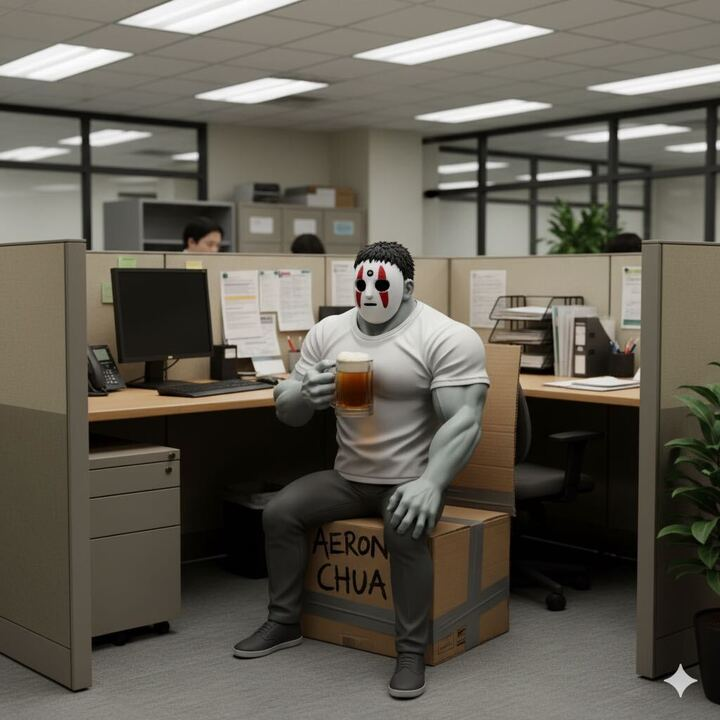

## 第二話「僕の席」
本来の席は窓際だったと判明。机には手書きの「窓際族」の貼り紙。
段ボール椅子の表記は「アーロンチェア」に訂正されている。もちろん快適。

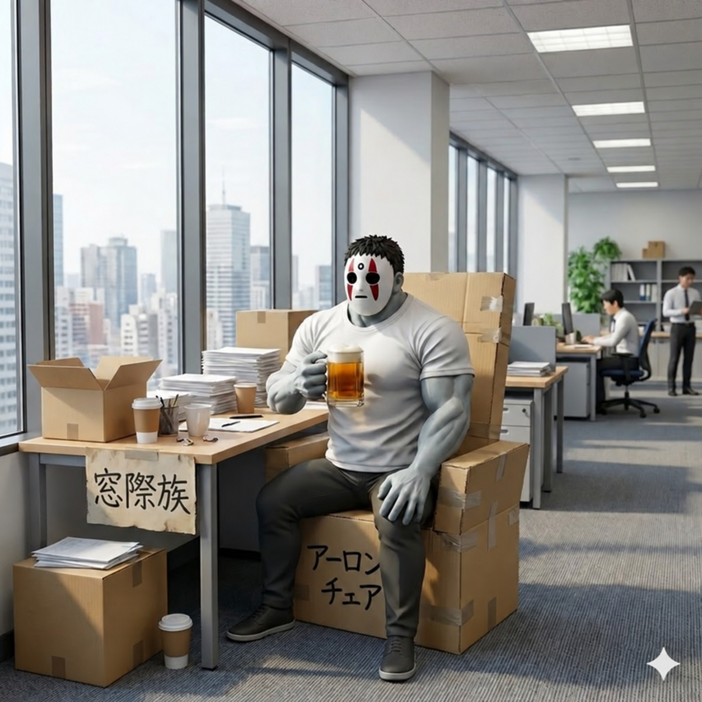

## 第三話「ベランダ席」
翌朝、席がビルの外壁のベランダへ移動。冬で寒いが「ビールが冷えたままなのでメリット」。
壁にやめたろうの社内指名手配書（賞金2億）が貼られている。

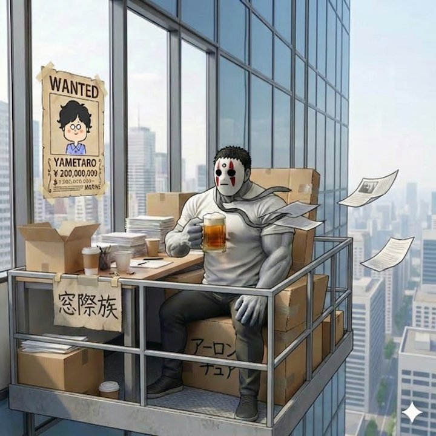

## 第四話「立ち飲み処 開店」
「会社がそうくるならこっちも自由にさせてもらう」とベランダに立ち飲み処を開店（暖簾＋赤提灯）。
ビールサーバが届かずジョッキtoジョッキで営業。とーくんがウクレレでBGM担当、福ちゃんが常連第一号。

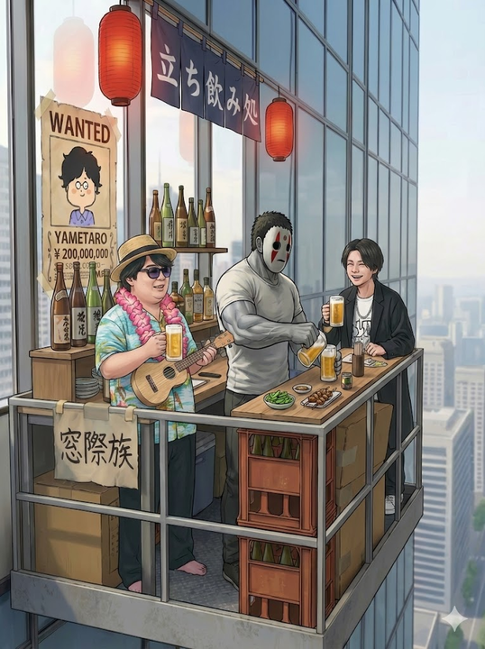

## 第五話「ビールサーバ到着」
サーバ到着でジョッキtoジョッキ卒業。「やめさん確保でビール永久無料キャンペーン」開始。

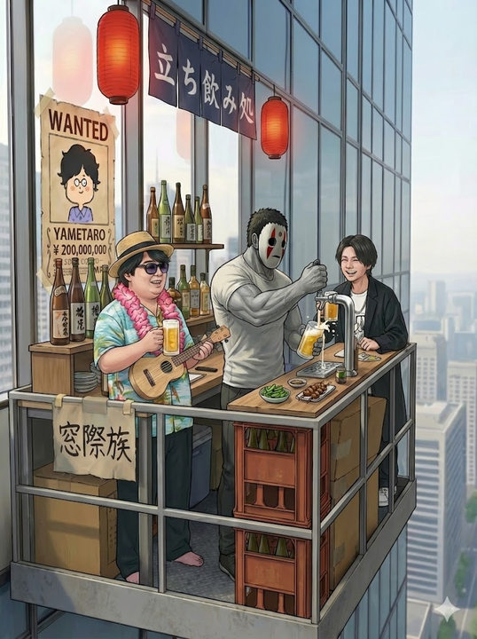

## 第六話「お店落下」
作りの悪さか酒の在庫過多か、店がベランダごと地上に落下。人的被害なし、酒瓶の棚は奇跡的に無事。
とーくんは頭を抱えて落ち込み、そば屋は黙々と片付ける。

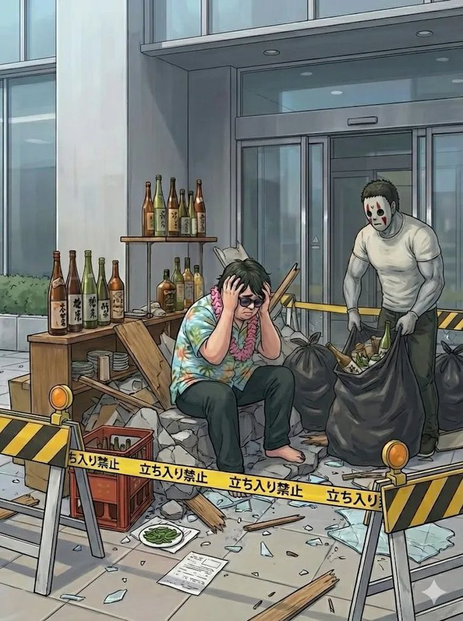

## 第七話「片付けと福ちゃん生存確認」
夕方まで片付けが続く。福ちゃんは手伝わず瓦礫の前で自撮りして楽しんでいる。
「窓際で生き残れてたのね！良かった！！」

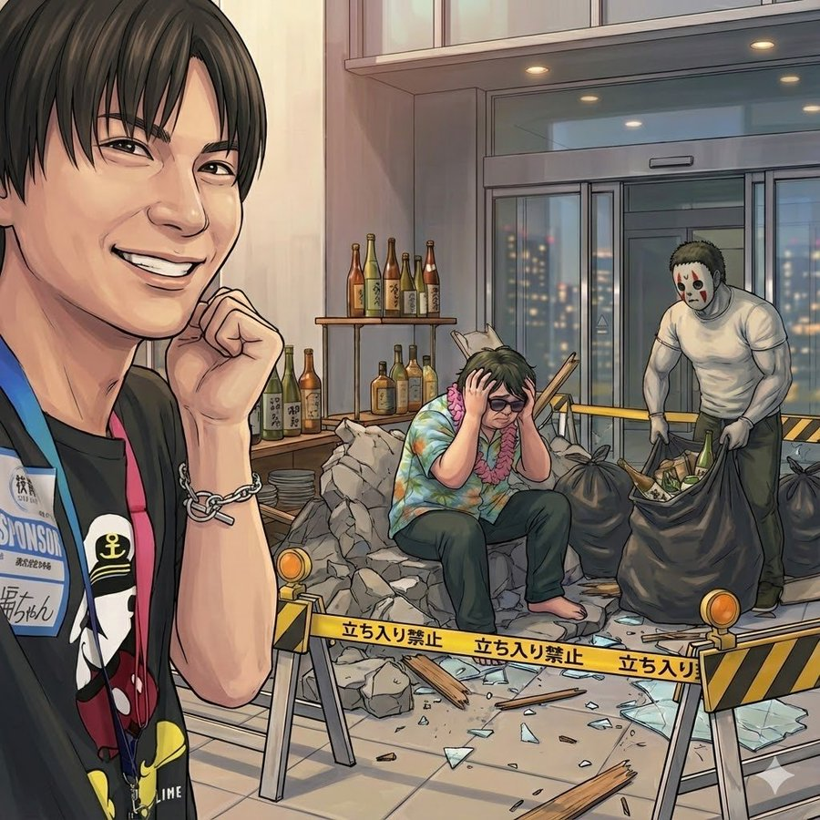

## 第八話「お店の再建」
地上・ビルの窓際の歩道沿いに木造屋台を再建。CTOのよーたんも駆けつける。
紫シャツ＋丸メガネの男（＝やめたろう）も釘打ちを手伝っている。

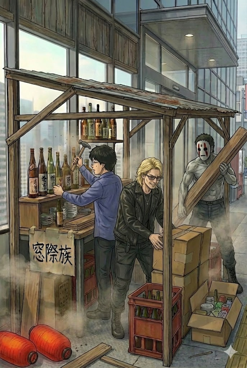

## 第九話「正体バレ」
よーたん「指名手配のやめ太郎じゃん！？」。WANTEDポスターを突きつけて正体を暴く。
そば屋は我関せずビールを飲みながら木材を運ぶ。

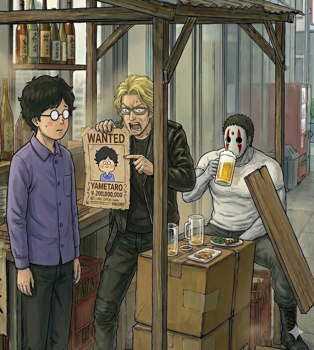

## 第十話「逃走」
やめたろう全力逃走、そば屋もジョッキを6個抱えたまま「ついでに」逃走。
舞台は赤坂（AKASAKA SACAS・東京タワーの見える街並み）。とーくんは路上でウクレレ演奏を続行。

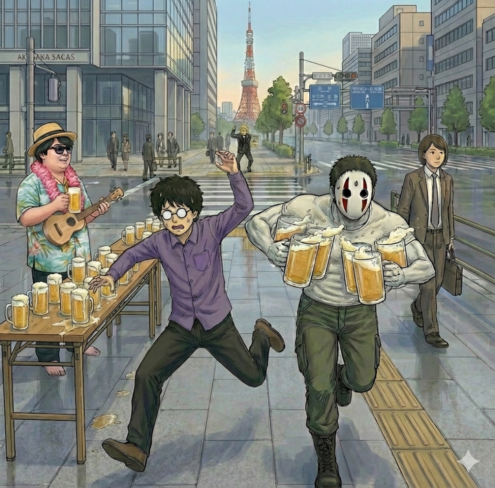

## 第十一話「タコ部屋に連行」
2人とも確保され、タコ部屋で働かされる（そば屋はタイピング、やめたろうは電話対応）。

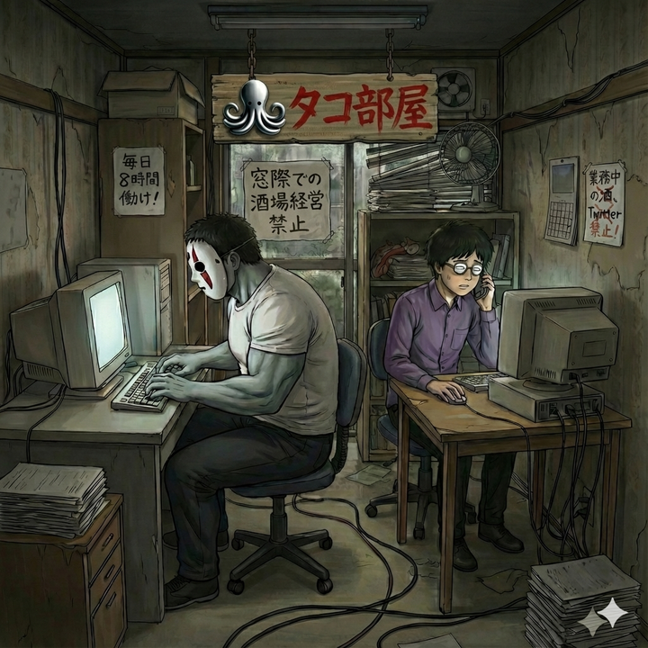

## 第十二話「脱走」
よーたんが差し入れを持って訪ねると、タコ部屋の壁に人型の大穴。2人は壁を破って脱走済み。

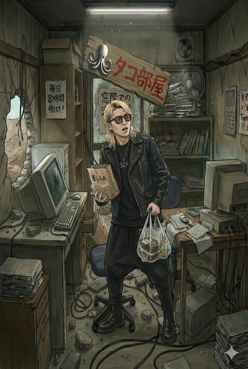

## 第十三話「窓際王おかやまん」

### 13_1「都内某社窓際会議室」
窓際王おかやまんがスクリーンにリモート出演。
おかやまん「そば屋とやめ太郎の脱走を許したと聞いて、大変驚いております」

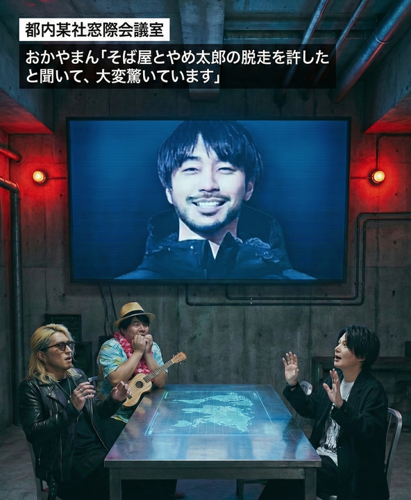

### 13_2「ゆめみ地下帝国 構想会議」
おかやまん「我ら窓際十人衆（Windows 10）の野望実現のため、2人を捕えゆめみ地下懲罰房送りにしてください」

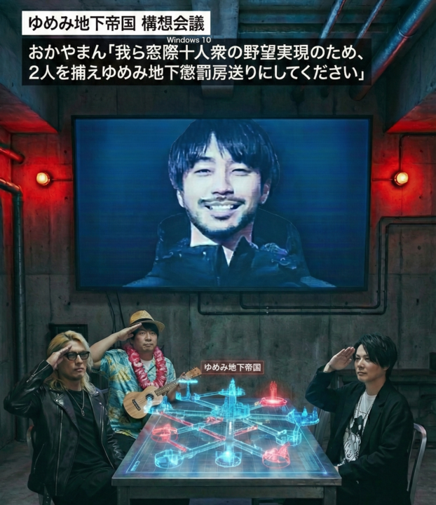

## 第十四話「BONK」
窓際の自席で居眠りしていたそば屋を、ゆめみんが木槌で「BONK!」と叩いて起こす。
そば屋は一瞬「今まで見てたのは全部夢か」と思ったが、全て現実の出来事である。

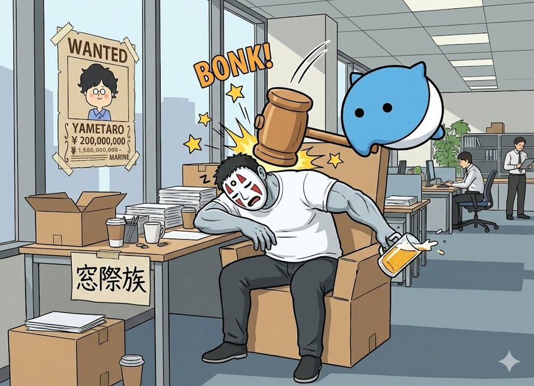

---

## 表記・呼称メモ
- キャラ名の正式表記は「無職やめたろう」。作中の手配書は「YAMETARO」「やめ太郎」表記のことがある
- やめたろうの社内指名手配書の正典素材は [`props/yametaro_wanted_poster.png`](props/yametaro_wanted_poster.png)
- そば屋はやめたろうを「やめさん」と呼ぶ
- 語りはそば屋の一人称SNS投稿風（「〜です！」と何でもポジティブに締める）が基本
