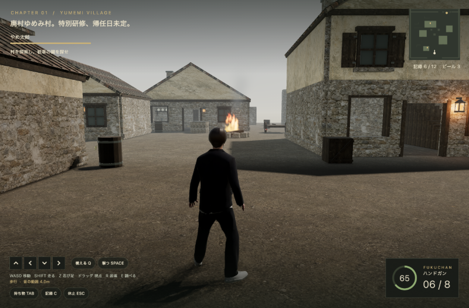
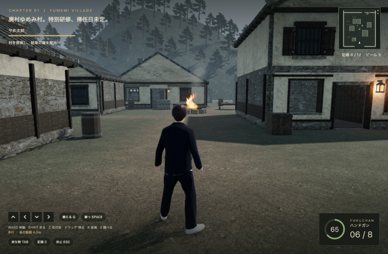

# そば屋ハザード 環境美術改善 — 2026-09-12

[Imagegenの目標画](village-target.png)と[生成プロンプト](prompt.txt)を出発点に、限られた描画資源でも素材・輪郭・道が読み取れる不穏な山村を目指した。見本はbuilt-in Imagegenで生成した美術方向の画像であり、ゲーム画面や速度の証明ではない。

採用したのは、青灰寄りの瓦、漆喰と暗い木材の大きな面分け、格子窓、重なった軒・垂木、側面の腰板、地際の陰と低い植生。村外周の柱状の岩は連続した稜線へ変え、北側に森林の遠景を追加した。既存の暖色ランタンと正典キャラクター・音声を継続使用する。

[第1パスの実画面](after-village-v1.png)では草の明るい三角板が目立ったため、第2パスで低い折れ葉と暗いオリーブ色へ修正。配置密度を下げ、小さな不規則な石を添えた。見本の樹林密度、瓦の曲面、自然な植生の量、地面の起伏までは再現しておらず、今後の改善余地として残る。

## 実画面の比較

| 変更前 | 改善後 |
| --- | --- |
|  |  |

同じ村入口・カメラ位置のMac debug画像。改善後は最終GLB・新照明を使用。静止した画作りの確認であり、通常プレイ経路やfpsの検証ではない。[地図の440px描画検証](cartography-wide-20260912.png)はWidgetテストから保存した形状確認用の画像で、テスト用フォントのため文字が矩形で表示される。日本語文字の可読性はMacアプリで別途確認する。

Macアプリの前面表示で、[農場の近景](farm-detail.png)、[山の建物](mountain-detail.png)、[窓越え中](window.png)、[日本語の地図](farm-map.png)、[映像設定](settings.png)も確認した。前3枚は静止した姿勢・カメラのfixtureで、高画質・保存済み100%設定を使用。設定画像は85%を選んだ操作確認中のもの。Macの既存100%設定は操作確認後に戻した。画像はMarionetteで800px幅に縮小保存している。

3つの画質プリセット、65／85／100%の解像度が独立して切り替わり、実際のAA・影解像度・GI設定へ反映されることを確認。既存のタッチ操作スイッチで発生したMaterial背景の警告も修正し、hot reloadと切替後に実行時エラーがないことを確認した。

[性能比較と残る負荷](../../GRAPHICS.md)ではM4 Mac・村8体・高画質85%の3回比較を記録している。山の大きな岩壁の輪郭・繰り返し模様、地面の大きな起伏、より自然な植生は、今回の建築・遠景改善後にも調整余地が残る。

## アセットの規模

変更前は今回着手時、変更後は美術2パスと建物結合後のGLB。primitiveはGLBの材質別描画単位で、実行時の描画回数は影などのパスや可視判定でも変わる。

| 地域 | 三角面：変更前 → 後 | primitive：変更前 → 後 | 埋め込み画像：前 → 後 |
| --- | ---: | ---: | ---: |
| 村 | 17,932 → 26,068 | 153 → 127 | 12 → 12 |
| 農場 | 13,655 → 19,833 | 113 → 93 | 10 → 10 |
| 山道 | 9,043 → 12,689 | 46 → 48 | 10 → 10 |

## 描画資源の使い方

地面は1.5mグリッドへ分割し、踏み固めた道、苔、建物際の陰を頂点色へ焼き込んだ。建物にも軒下・基礎の陰と素材の色を焼き、共有アルベドへ乗算する。追加の地面テクスチャやデカール用の描画を必要としない。[生成処理](../../../tools/hazard_environment_art.py)は既存の配置とは独立した乱数を使う。

建物本体は家ごとの色焼き込み後に、[結合処理](../../../tools/hazard_environment_batch.py)で材質単位の`StaticArchitecture`へまとめた。村の建物本体50→10、農場40→10 primitive。家ごとのカリングは失うため、画面外の家の面も描画対象になり得るが、小さなマップではCPU側の描画処理の削減を優先した。屋根・門・収集物・標的・炎・樹木patchは独立した表示ノードを保持する。

## 保持した内容と監査範囲

3章の配置JSONは変更前とバイト単位で一致し、家、衝突、階段、敵、拾得物の配置を維持した。見た目と既存開口のずれは、農場の幅4m小屋の窓幅と、山の家の窓上端を覆っていた漆喰帯を修正。[環境監査](../../qa/environment-art-20260912.json)では結合後のメッシュへ同じ条件の開口レイ180本（村90・農場72・山18）を通し、頂点色・屋根ノード・予算も確認した。

[独立GLB比較](../../qa/environment-batching-20260912.json)の全属性比較は、結合対象の建物本体が対象。全三角面の位置・法線・UV・頂点色・材質、および属性要素数が結合前後で一致した。非Houseノードについて確認したのは名前の保持（村78・農場47・山30）で、全属性の比較ではない。これらはアセットと開口の監査記録であり、実機のフレーム性能は別途測定する。
